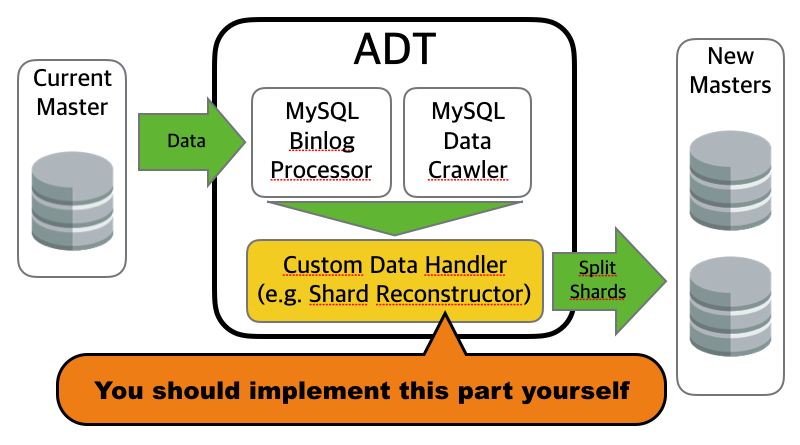
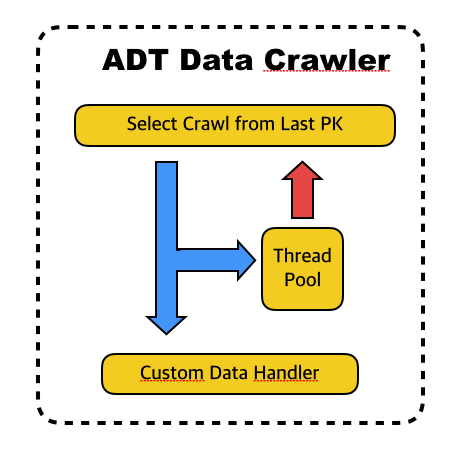
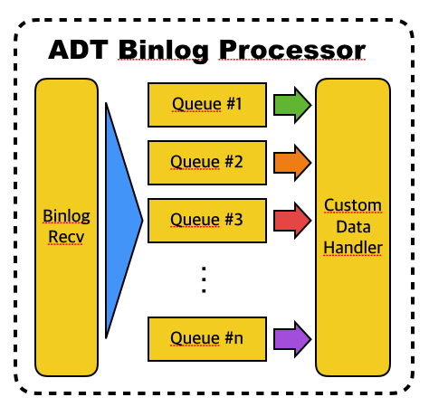

# ADT

## About ADT

`A` Almighty <br/>
`D` Data <br/>
`T` Transmitter <br/>

Using ADT, You can receive **all real time changes of MySQL**, transform the received data, and load to other data storage.
Depending on the use, it is not only for a one-time use, also can be used as live migration purposes.

---------------------------------------------------------

## Examples of Usage

- Change rule of, or reconstruct MySQL shards
  - Add new DB in modulus-sharded environment
  - Change shard rule (e.g. Modulus <--> Range)
  - Reconstruct MySQL shards from user ID based to GPS point based in real time
- Copy from MySQL to other different table, DB, or NoSQL in real time
- By detecting real time changes, send push-noti asynchronously.

In summary, usages can be grouped in two types.
- One-time migration
- Real-time migration

---------------------------------------------------------

## Features

### Custom Data Handler

- Methods that handle collected data
- **You should implement your own data handler**

```java
// Please see com.kakao.adt.handler package
void processData(MysqlBinlogData data) throws Exception;
void processData(MysqlCrawlData data) throws Exception;
```

- you should consider **thread-safe** when implement methods, because the method named **processData** may be invoked by multiple threads.
- In the picture, the example handler split into 2 shards.



### Table Crawler

- Execute `SELECT` query in primary key order

```sql
# Loop of this query
SELECT * FROM ? [ WHERE id > ? ] LIMIT ? [ FOR UPDATE ]
```

- Selected data is passed to data handler that you implemented
- Pipelined Execution
  - Between invoking `SELECT` query and your data handler, another thread `SELECT` next data.
  - Though `SELECT` is executed in order, data handler is NOT invoked in order.



### Binary Log Receiver

- Receive binary logs(row format) using MySQL Replication Protocol
- Selected data is passed to data handler that you implemented
- Parallel Execution
  - In picture, events are enqueued by a single thread, but dequeued by multiple threads.
  - Only one thread for a queue
  - If same queue, then it means events should be processed sequentially.
  - In other words, if values of unique key(include primary key) are the same between two row events, then the events are passed to your handler sequentially.
  - Otherwise, events are passed to the handler in parallel.



---------------------------------------------------------

## Requirements

- MySQL binary log format should be full(not minimal) `row` format. `mixed` or `statement` are unsupported.
- All table should have primary key index.
- About data handler,
  - You must implement your own data handler, because `ADT` just receive/collect data, and invoke data handler.
  - You should consider thread-safe.
  - `ADT` can be restart caused by error or your deployment. (See 'How to Handle Error')
- Can't handle DDL like `ALTER TABLE`
- Can't parse millisecond of `datetime` type

> If you have any question, please ask through the issue tracker.

---------------------------------------------------------

## How to Handle Errors

> This chapter is only for Binary Log Receiver.

1. Error Detection --> `ADT` may shut down
2. Restart from the last complete binlog file
3. If a event is that already processed, then overwrite or skip
4. Otherwise, just process normally.


- `ADT` may shut down when any error occurs.
- For data integrity, it is recommended that restarting from last complete binlog file.
  - All row events are not processed in sequential.
  - So, for data integrity, `ADT` may process some row events twice when restart.
  - To solve this problem, **adt-handler-mysql-shard-rebalancer**, an example handler, always overwrite data.

---------------------------------------------------------

## How to Use ADT

### Implement Your Custom Handler

1. Create new Maven project
2. Open pom.xml file, and inherit **adt-handler-parent**
3. Implement handler(s)
  - Implement **MysqlBinlogProcessorHandler** interface if you want to handle binary logs
  - Implement **MysqlCrawlProcessorHandler** interface if you want to use table crawler

> Refer to **adt-handler-mysql-shard-rebalancer**

```xml
<!-- inherit adt-handler-parent -->

<!-- pom.xml -->
<project ...>
    <modelVersion>4.0.0</modelVersion>
    <parent>
        <groupId>com.kakao.adt</groupId>
        <artifactId>adt-handler-parent</artifactId>
        <version>${adt-current-version}</version>
    </parent>
    <artifactId>adt-handler-foo-bar</artifactId>
    <name>This is an example custom handler</name>
</project>
```

### Build

1. Build ADT: ADT doesn't exist in Maven Repository yet, so you should build yourelf.
2. Build your own handler
3. Check your build results

```sh
# 1. Build ADT

cd $ADT_HOME
mvn install -DskipTests=true
```

```sh
# 2. Build Handler

cd $HANDLER_HOME
mvn package
```

```sh
# 3. Check outputs

cd $HANDLER_HOME/target/jar
ls -1
```
```
adt-handler-foo-bar-0.0.1-SNAPSHOT.jar
adt-worker-0.0.1-SNAPSHOT.jar
commons-dbcp2-2.1.1.jar
commons-logging-1.2.jar
commons-pool2-2.4.2.jar
jackson-annotations-2.6.0.jar
jackson-core-2.6.5.jar
jackson-databind-2.6.5.jar
jts-1.13.jar
logback-classic-1.1.6.jar
logback-core-1.1.6.jar
mysql-connector-java-5.1.38.jar
open-replicator-1.4.2.jar
slf4j-api-1.7.19.jar
```

### Execution

1. Set classpath
2. Set worker type
  - See **WorkerType** in **com.kakao.adt.WorkerMain**
3. Set ADT config file path
  - File location is relative on the basis of a JVM default system property,**user.dir**.
  - Config files should be written in JSON format.
  - When ADT start up, your JSON file is deserialized into a config object.
  - See **MysqlBinlogProcessorConfig** / **MysqlCrawlProcessorConfig**
4. Set main class: **com.kakao.adt.WorkerMain**
5. Run

```sh
java -cp `echo lib/*.jar | tr ' ' ':'` \
-Dcom.kakao.adt.worker.type=MysqlBinlogReceiver \
-Dcom.kakao.adt.worker.configFilePath=foo_bar_config.json \
com.kakao.adt.WorkerMain
```

---------------------------------------------------------

## Test ADT

> This chapter is about how to test ADT when you modified ADT,
> not for your custom handler

### Unit Test

#### Requirements
- MySQL Server(s)
  - Port 3306
  - Global Variable `log-bin=ON`
  - Global Variable `binlog_format=row`
  - Account
    - username: `adt`
    - password: `adt`
- Add custom domains in **/etc/hosts**
  - [your mysql ip] adt-test-my001.example.com
  - [your mysql ip] adt-test-my002.example.com
  - [your mysql ip] adt-test-my003.example.com

#### Run Test

```sh
cd $ADT_HOME
mvn test
```

### System Integrated Test

> Integrated test uses **adt-handler-mysql-shard-rebalancer**.

1. Go to directory **adt-test/msr_test_script**
```sh
cd $ADT_HOME/adt-test/msr_test_script
```

2. Copy **server_list_template.sh** as **server_list.sh**, and edit
```sh
cp server_list_template.sh server_list.sh
vi server_list.sh
```

3. Copy **msr_binlog_test_config_template.json** as **msr_binlog_test_config.json**, and edit
```sh
cp msr_binlog_test_config_template.json msr_binlog_test_config.json
vi msr_binlog_test_config.json
```

4. Deployment
```sh
./deploy_system_test.sh
```

5. Reset Database Status
```sh
# Reset binary logs & create tables
./reset_db_adt_test.sh
```

6. Execute many DML queries
```sh
./startup_dml_query_tool.sh
```

7. Run ADT
```sh
./startup_adt_binlog_processor.sh
```

8. Check data integrity
```sh
./startup_data_integrity_checker.sh
```

9. (Optional) Shutdown Master DB
```sh
./startup_src_db_trouble_maker.sh
```
  - After this, ADT may shut down.
  - Then, restart it from the last complete binlog file.

---------------------------------------------------------

## Example Handler: MySQL Shard Rebalance Handler

- Using this handler, you can make your DB split into multiple shards.
- If you want to use this handler, modify **getShardIndex** method in **AbstractMysqlHandler** class.
- It's your responsibility for problems that can be occurred when using.


---------------------------------------------------------

## Parallel Execution & Data Integrity

> This chapter is only for Binary Log Receiver.

Usually, relational database has 4 integrity constraints.
([wikipedia - Data Integrity](https://en.wikipedia.org/wiki/Data_integrity#Types_of_integrity_constraints))

- Domain Integrity: column type, NOT NULL, CHECK, ...
- Entity Integrity: primary key, unique key
- Referential Integrity: foreign key
- User-defined Integrity: (not considered)

First, domain integrity is not our concern.
All data in row events are already satisfied this integrity.
So, we consider only entity & referential integrities; Results of DMLs can be different caused by these integrity.

MySQL has three entity/referential integrities.

- unique key (include primary)
- foreign key

However, FK is not considered, neither.
Data in binlog means that it satisfies FK, and changed data caused by FK may exist in binlog, too.
When you load data to your target database (with **SET FOREIGN_KEY_CHECKS = 0;**),
FK constraint may be broken for a moment.
But, finally all data will be loaded include automatically changed data,
and data integrity problem will be solved.

So, we consider only two constraints: primary key and unique key.

---

Special Thanks to [Chan(성동찬)](http://gywn.net/)

End of Document
